# Zilog Z80 TV computer - 2008 college project

## The CPU board

The CPU gets the clock and interrupt signals from the video panel. The Z80 refresh function is masked out, the reason is the unnecessary interference with the Video circuit during memory access. I'll describe this problem at the Video panel section. Otherwise it's a standard Z80 circuit interfaced with static RAM, ROM and the keyboard peripheal circuit. 

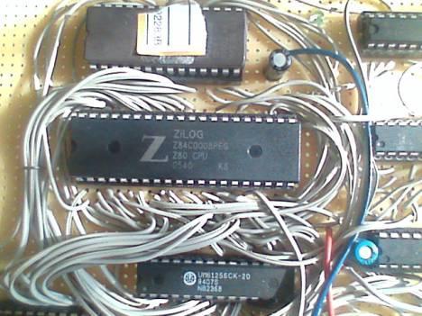

Top: EPROM with system software
Center: CPU
Bottom: UM61256 CMOS SRAM (32 kBytes) 

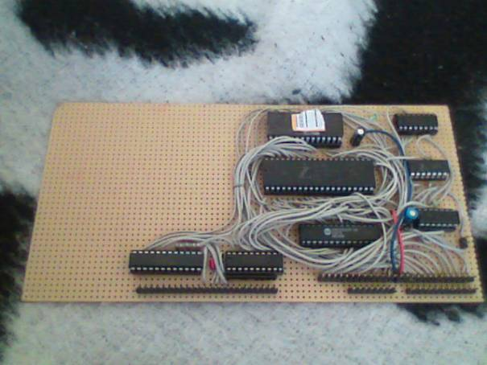

Bottom left: Keyboard connector, 74HC154 (left), 74HC245 (right) These are the keyboard peripherial circuits
Middle top: EPROM with system software. 0x0000 - 0x0fff
Center: Z80 CPU
Middle bottom: 61256 32k x 8 CMOS SRAM, 0x8000 - 0xffff
On the right: 74HC138, 74HC32, 74HC04
Bottom right: System connectors. The upper is attached to the Video board.

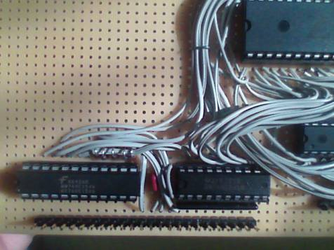

Left: 74HC154 Selects the keyboard row by address
Right: 74HC245 Places the column data on the data bus, when the keyboard is selected by address
Under the HC245 you can see a pull up resistor, which pulls up all the 8 data wires to '1' 

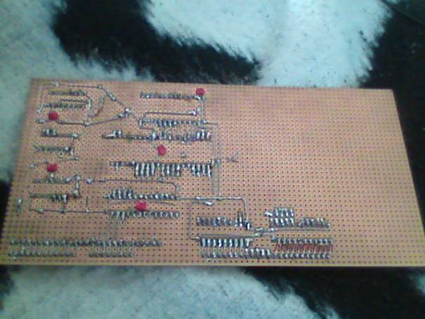

Bottom side of the CPU panel
You can see a series of 1N4148 diodes on the bottom right, these protect the keyboard circuit from short-circuit when two keys are pressed simultaneously.
Also you can see some power supply filter capacitors (100 nF) attached to almost each IC-s.
The power supply wire is driven at this side of the panel 

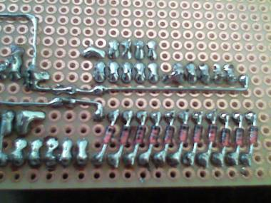

The 1N4148 diodes and the naked power supply wires. 

## The Video board

This panel was assembled prior to the CPU board, and it was very challenging to design. First I populated the left side of the panel with the 8 ICs that are responsible for timing and sync signal generation. The result was a circuit that could draw a big white box on the TV screen.

The finished Video circuit generates white 32x32 alphanumeric characters (8 x 8 pixels each) on a black background. It consists of five cooperating circuits:

1) Timing and signal generating circuit
This circuit is based on a synchronous counter chain (3 x 74HC590), an 8 MHz oscillator which drives the counter, and a couple of logic gates. The logic gates generate the h-sync, v-sync and "active draw area" signals based on the current value of the counter chain. Also some gates are responsible for resetting the counter when the TV-picture drawing is complete. An additional circuit (74HC74 and an SR flip-flop) generates the 25 Hz maskable interrupt signal for the CPU.

2) Address bus multiplexer and data bus transceiver
The Video board has its own video SRAM (VRAM), which can be accessed by either the Video circuit for drawing the TV picture, or by the CPU for reading or writing. The address bus multiplexers (3 x 74HC157) select either the output of the counters, or the CPU address lines as the source of the VRAM address line, depending on the current operation mode. The data bus transceiver (74HC245) interconnects the VRAM data bus with the CPU data bus and sets the data direction, depending on the current operation (reading or writing).

3) VRAM, character generator and output shift register
When the circuit is in the process of drawing a TV picture, the counter provides the address signal for the VRAM, and the character generator looks up the current character bit pattern by the ASCII code provided by the VRAM. The output shift register is parallelly loaded by this bit pattern and the 8 MHz clock signal shifts out this data, generating the pixels.

4) CPU clock generator and stopper
When the video circuit is in the "active draw area", a CPU access to the VRAM would mess up the screen, because the VRAM has only one data line and the CPU would use it while it was supposed to be used to provide ASCII codes of the current character position to the character generator address line. To prevent this interference, the CPU stopper circuit suspends the CPU clock when the CPU attempts to access VRAM while the Video circuit is in the "active draw area". CPU clock resumes once the counters leave the "active draw area" and reach the borders of the TV picture (around vsync and hsync lines), where a CPU access wouldn't cause interference. The CPU is stopped only when accessing the VRAM, otherwise it runs at full speed, regardless of the current status of TV picture drawing process (the Z80 refresh feature is masked out to prevent unnecessary CPU stop when the refresh registers reach the VRAM memory area). Another feature of this circuit is to let the CPU finish any ongoing VRAM operation when the counters just enetered into the "active draw area". The parallel loading of the shift register happens at the end of each character cycle, allowing sufficient time to the VRAM and the character generator to prepare and provide data, and allowing some time to the CPU (min. 3 T cycles) to finish any ongoing operation. It wouldn't be a good idea to take away the data and address lines while the CPU was just writing the VRAM with the /we signal low. The circuit responsible for ensuring safe operation is a very strange bistable multivibrator, consisting of two OR (74HC32) and one AND (74HC08) gates.
The CPU clock generator is a by-2 divider (74HC74 and 74HC86), able to stop the clock at the current phase on demand. CPU clock frequency is 4 MHz.
The CPU stopper, the clock generator and the interrupt generator is a retrofit (the rightmost 3 ICs on the panel). In the original design the CPU clock was taken from the first stage of the counter chain and there were no periodic interrupts at all.

5) Analogue signal mixer
Currently a 220 ohm potentiometer is responsible for mixing picture data with sync signals. 

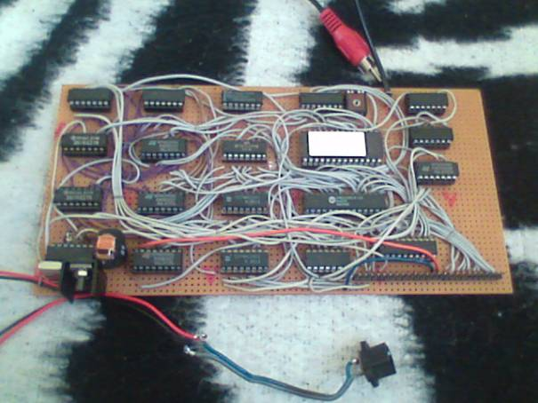

From left to right (5 columns)
From up to down (4 rows)
1. Column
Row: 74HC04 inverters
Row: 74HC21 5-input NAND for horizontal and vertical sync signals
Row: 74HC21 5-input NAND for horizontal and vertical sync signals
Row: 74HC04 inverters 8MHz Oscillator, Counter reset
2. Column
Row: 74HC32 OR gates, mixing horizontal and vertical sync signals
Row: 74HC590 8 bit synchronous counter for timing the Video board and the CPU interrupts LSB
Row: 74HC590 8 bit synchronous counter for timing the Video board and the CPU interrupts
Row: 74HC590 8 bit synchronous counter for timing the Video board and the CPU interrupts MSB
3. Column
Row: 74HC30 8 input NAND gate, generates signal for Parallel loading of the Shift register
Row: 74HC157 2 input multiplexer, selects the address source of the Video RAM (counters / CPU address line)
Row: 74HC157 2 input multiplexer, selects the address source of the Video RAM (counters / CPU address line)
Row: 74HC157 2 input multiplexer, selects the address source of the Video RAM (counters / CPU address line)
4. Column
Row: 74HC165 Parallel in Serial out shift register for generating video signal (on the right you can see the potentiometer for mixing video and sync signals)
Row: 27C256 Character Generator EPROM Gets the address from the data output of the Video RAM. Gives data to the Shift Register parallel input.
Row: UM61256CK-20 32k CMOS SRAM, the Video RAM. The same as in the CPU board, but only 1 kBytes is used.
Row: 74HC32 OR gates
5. Column
Row: 74HC86 XOR gates for the clock divider. The 74HC86 can stop the CPU clock (74HC74 feedback )if the CPU wants to use the Video RAM during picture drawing
Row: 74HC74 1.) Clock divider. To divide the Video clock (8MHz) to 4MHz for the CPU. 2.) Divider to generate hardware interrupts (25 / sec)
Row: 74HC08 AND gates
Row: Just above the connectors : 74HC245 Dual direction bus driver for the Data bus. 

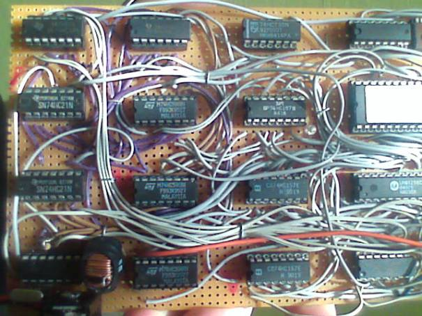

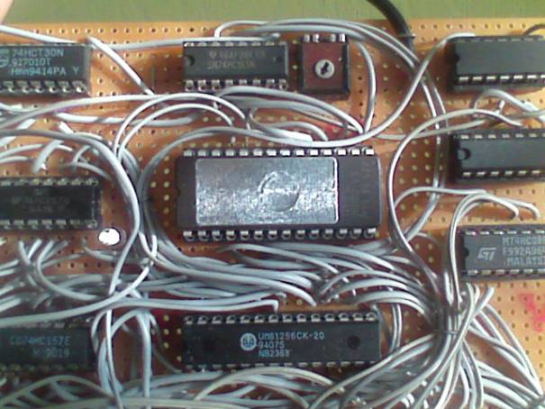

Center view of the Video panel
Top: 74HC165 Shift register with the mixing potentiometer. (this is the 'Brightness' adjust knob :-)
Center: 27C256 Character Generator EPROM (the lower 2kBytes are used for the 256 8x8 characters)
Bottom: 61256 Video RAM. I have these SRAM circuits from a dead 486 motherboard. It's fast and it was for free :-P
Left: 74HC30 Selector for the Shift Register, 74HC157 Address line multiplexers
Right: Clock divider and interrupt generating circuits for timing the CPU 

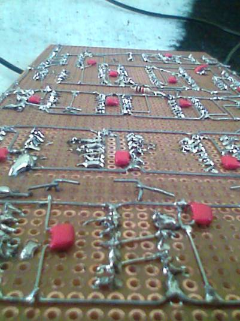

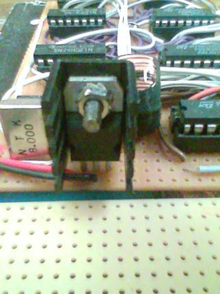

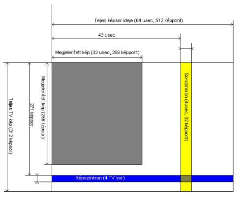

Gray area: The text area (256 rows, 256 pixels each), one text row due time: 32 usec
Yellow: Horizontal Sync (4 usec, 32 pixels time)
Blue: Vertical sync (4 rows time)
Time of entire row: 64 usec (512 pixels time)
Time of entire picture: 312 rows
Row frequency: 15625 Hz
Picture frequency: 50 Hz, non-interlaced mode

As it is, the counters in the Video circuit start from 0 and finishes at 159744.
In the gray area, the Video RAM is used by the video circuit, so if the CPU gives an address which is in the Video RAM address space, the video circuit stops the clock of the CPU until the counters leaves the text area. If the CPU doesn't use the Video RAM, the video circuit doesn't stop the CPU at all.

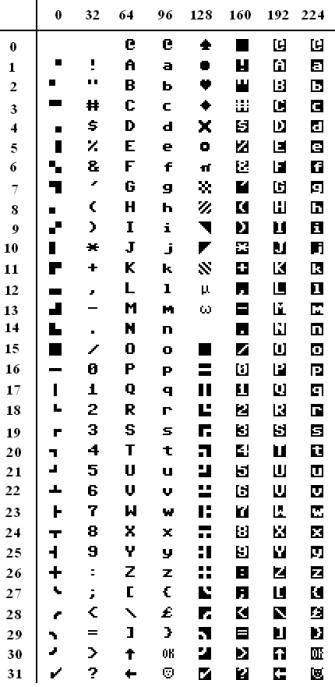

Character set of the computer (Most of the characters are copied from the C64 character set).
I drew some special characters by my own, like face symbol, O.K., 'micro' and 'omega'.
The first 16 characters are the 'quarterpoint' graphic symbols, to create simple graphics. 

## The Keyboard

As you can see, it's not my product, originally it was made for an XT-class laptop computer. I unsoldered the controller, figured out the layout and soldered ribbon cables to the row and column lines. It has 16 Rows (on the left, two, 8 wire ribbon cables) and 8 columns (on the right).
I bought this keyboard at a PC second hand shop for approximately 0.2$ (!), it is equipped with Cherry MX Blue keyswitches. 

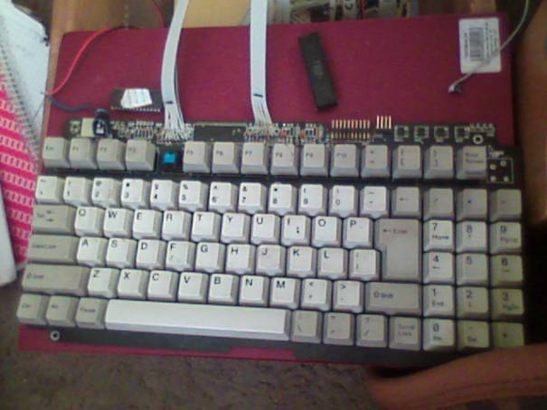

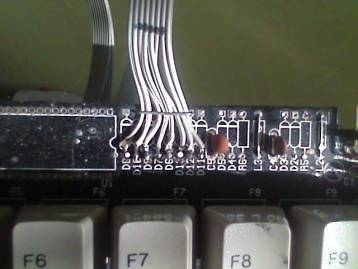

## Entire Computer

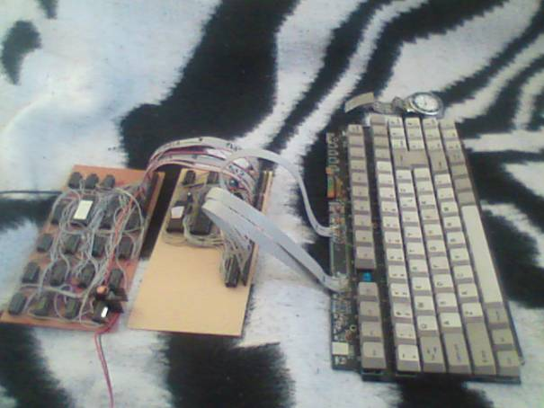

The way of attaching the boards to each other
Left: Video panel
Center: CPU panel

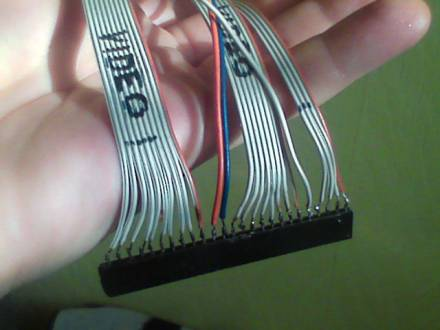

This is the Video panel side of connection cable between the two circuit boards
Left: Address bus, 10 bits for 1 kByte
Center: Power supply, System ground
Right: Data bus, CPU clock (4MHz, can be stopped by the Video circuit), CPU Maskable Interrupt, Video select, Read, Write 

## Screenshots

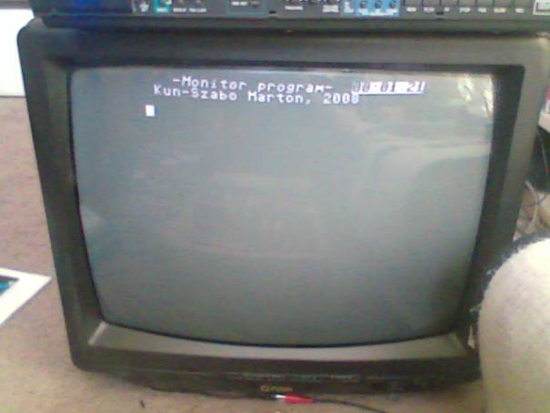

This is the login screen of the Monitor program.
On the top right you can see a clock, which shows the elapsed time since boot-up. This clock can be set to the actual time and it'is always on the screen at the same place as long as the interrupts are enabled and a specific bit is set in the RAM. The cursor drawing and flashing mechanism works exactly the same way.
Text space is 32 X 32 characters, the editor program automatically scrolls the screen upon reaching the bottom.
After pressing the Enter key, the editor/monitor program looks for commands, and if finds than executes it. For example: 'T12:14:00' sets the clock to 12:14:00

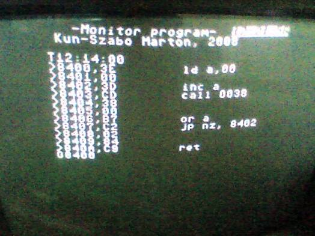

This is a sample workflow:
In the first row I set the clock to 12:14:00
Then I entered the memory editing commands '>', entered the addresses and data, and pressed 'Enter' after each line.
When I finished with the program, I typed 'G' which is the execute command, running the program from the specified address.
The 'G' command runs programs as a subroutine so they should finish with a RET instruction in order to return to the editor. 

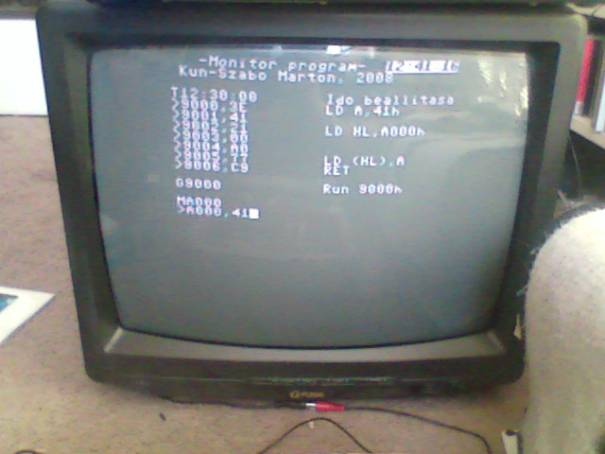

This small program loads 41h to A000h address. At the end, I check the content of A000h, and it's 41h, so the Z80 is certainly working as it's supposed to :-)
The 'M' command gives the content of the given memory location. It writes a 'memory write' command in the next line with the data so an immediate modifaction can be made. The idea of these commands came from the Commodore 16 / Plus4 built-in monitor program. 

## Graphics

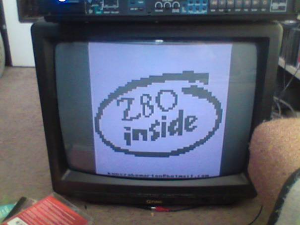

This is a demonstration of the 64X64 monochrome graphics.
The video board doesn't have real graphic mode, but there are 16 different 'quarterpoint' characters stored in the Character Generator, which can be used to draw these simple graphics. 

